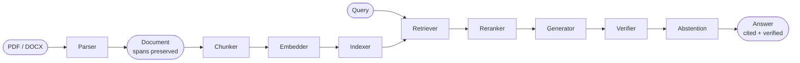

# Architecture

## The pipeline

A `verifiable_rag.Pipeline` is a strict left-to-right composition of pluggable components:



Every step is a **Protocol** — swap any component by passing a different implementation:

```python
from verifiable_rag import Pipeline
from verifiable_rag.parsers import DoclingParser
from verifiable_rag.chunkers import ParentChildChunker
from verifiable_rag.embedders import CohereEmbedder
from verifiable_rag.indexers import HybridIndex, LanceDBIndex, BM25Index
from verifiable_rag.rerankers import CohereReranker
from verifiable_rag.generators import ConstrainedCitedGenerator
from verifiable_rag.verifiers import DualNLIVerifier, HHEMVerifier, MiniCheckVerifier

pipeline = Pipeline(
    parser=DoclingParser(),
    chunker=ParentChildChunker(max_child_tokens=400),
    embedder=CohereEmbedder(),
    indexer=HybridIndex(dense=LanceDBIndex(uri="my_idx"), sparse=BM25Index()),
    reranker=CohereReranker(),
    generator=ConstrainedCitedGenerator(model="anthropic/claude-haiku-4-5"),
    verifier=DualNLIVerifier(HHEMVerifier(), MiniCheckVerifier()),
    strictness="balanced",
    top_k_retrieve=100,
    top_k_rerank=10,
)
```

For most use cases you'll never write this — call [`hybrid_balanced()`](../api/presets.md) or [`Pipeline.from_yaml()`](../api/pipeline.md) instead.

## The data model

The library has one rigid hierarchy that every component honors:

```
Document
├── Section(id, title)
│   ├── Paragraph(id)
│   │   ├── Sentence(id, text, span)
│   │   └── Sentence(id, text, span)
│   └── Paragraph(id)
└── Section(id, title)
    └── ...
```

Every `Sentence` has:

- A stable `id` (e.g. `"paper::s142"`)
- The `text` content
- A `Span` with `(doc_id, char_start, char_end, optional bboxes)`

**Sentences are the atomic unit of citation.** Every generated `CitedSentence` references back to `Sentence.id` values from the source `Document`, and from there to exact character offsets in the parsed text.

## Span preservation invariant

The core rule that everything else builds on:

> If at any point a generated sentence in the answer cannot be traced back to `(doc_id, page, char_start, char_end)` in the source, the system is broken.

Every parser, chunker, retriever, and rerank step **must preserve character offsets**. This is enforced by round-trip tests in CI: parse a document, walk through every transformation, and verify the final `sentence_by_id(sid).text` exactly matches the source span content.

This invariant is what makes the library's auditability claim real. The HTML audit report turns every cite ID into an anchor link to the source passage — that link works because the spans never lost their offsets.

## Citation granularity ≠ chunking granularity

A common confusion:

| Question | Answer |
|---|---|
| What's the retrieval atom? | A `Chunk` (~400 tokens by default) |
| What's the citation atom? | A `Sentence` (one human sentence) |
| Why decoupled? | Retrieval works better at chunk granularity; citations are more useful at sentence granularity. |

When the chunker emits a chunk, it carries `sentence_ids` — the list of every sentence inside that chunk. The retriever returns chunks; the generator emits cited sentences referencing the source sentences inside those chunks; the verifier checks each generated sentence against the cited source sentences (not the full chunk).

You can chunk at 512 tokens for retrieval and still emit sentence-level citations. The IDs travel through.

## Parent-child chunking

The default chunker (`ParentChildChunker`) produces small child chunks (~400 tokens) for retrieval precision, but stamps `section_id` and `paragraph_id` metadata on each so a parent context can be expanded at generation time:

```python
chunk.metadata = {
    "section_id": "sec_3",
    "paragraph_id": "sec_3::p1",
    "paragraph_ids": ("sec_3::p1",),
    "page_first": 4,
    "page_last": 4,
    # ...
}
```

The `ParentExpander` consumes that metadata to compute the larger context the LLM should actually see — typically the full section or a window of nearby paragraphs.

End-to-end:

- **Retrieve** with small precise chunks → tight semantic match
- **Generate** with expanded parent context → LLM has surrounding text
- **Cite** by sentence_id → exact source location

## Hard rules

These are tested in CI and called out explicitly because they're the contract the library makes:

1. **Span preservation is non-negotiable.** Every transformation preserves character offsets. Round-trip tests verify this.
2. **Citation granularity ≠ chunking granularity.** Don't let a "simplification" collapse `sentence_ids` into chunk-level metadata.
3. **Faithfulness verification is mandatory in `strict` and `paranoid` modes.** A `strict`-mode answer that didn't actually run verification is a bug, not a feature.
4. **No silent failures in the citation layer.** If the generator can't find supporting sentences for a claim, the claim is flagged or stripped — never returned silently as if cited.
5. **Eval before optimization.** Don't tune thresholds, swap embedders, or "improve" anything without running the benchmark suite first.

These rules are why the library exists. They're also why it's the right choice for use cases where wrong answers are worse than no answer.
